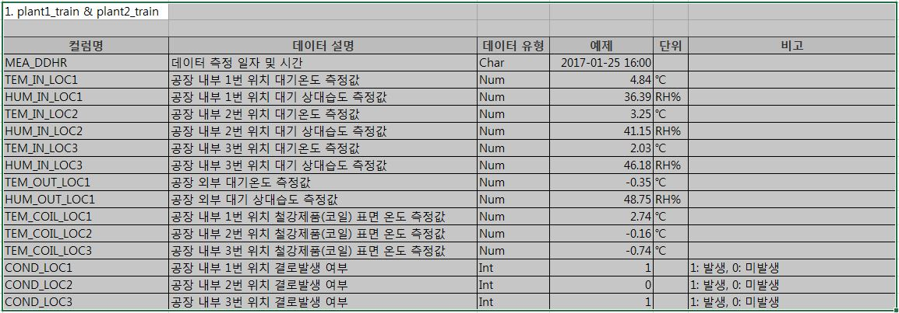

# Dew_Prediction
기상청에서 주최한 2020날씨 빅데이터 콘테스트 참가기록
## 개요
- 기상청 데이터와 현대제철 공장 데이터를 사용해서 결로 발생여부를 예측
- 머신러닝 분류 및 회귀 모형을 통해 예측
## 데이터
- 기상데이터 : ASOS(서산), AWS(당진,신평), 동네예보(송악읍)(출처 : [기상자료개방포털](https://data.kma.go.kr/cmmn/main.do), [날씨마루](https://bd.kma.go.kr/kma2019/svc/main.do))
- 공장데이터 : 2016~2019년의 공장 내부온도, 공장 내부습도, 코일 표면온도, 공장 외부온도, 결로 발생여부   
</img>
## 전처리
- 날씨마루기상포털의 HIVE에 저장된 데이터를 서버의 RStudio에서 1차 편집
- Pandas 패키지를 이용하여 데이터프레임 사용
## 머신러닝 및 상관관계분석
### Note
- 결로 발생은 코일의 표면온도가 공장내부의 이슬점 온도보다 높을때 발생
- 이슬점 온도는 공장 내부온도와 공장 내부 습도에 의해 결정됨
- 상관관계 분석 결과 코일온도, 내부온도, 내부 습도, 해면기압등 이 상관관계가 높게 나왔음
- 날씨는 시계열 데이터 이므로 train_set과 test_set을 분리 할때 random split 하지 않고 시간 단위로 분리

### 사용 모델 : RandomForest, LightGBM, Linear, MLP, XGBOOST   
- 1차 머신러닝 : 해면기압을 포함하여 공장 내부온도 내부습도 코일온도를 예측
- 2차 머신러닝 : 온도와 기압은 시계열데이터이므로 칼럼에 시간 정보를 추가하고 XGBOOST모델을 추가하여 예측
- 3차 머신러닝 : 가용가능한 모든 데이터를 포함하고 상관관계가 높은 상위 column들만 포함하여 직접 결로 발생여부를 Classifier로 예측
- 4차 머신러닝 : data의 시간의 밀도가 뒤로 갈수록 높아져서 50000개의 row중 뒤쪽 10000개의 데이터가 겨울에만 해당한다는 것을 알게되었고 
이로 인해 과적합이 발생하였음 이에 따라 2017년 일년의 데이터를 test_data로 split 하고 예측

## 결과
- CSI = 10.97%, AUC = 0.5
### Feedback
- 전처리 숙달 미흡으로 전처리에 대한 시간이 오래걸림
- 시각화를 통한 분석이 더 필요함
- 머신러닝 모델들의 Parameter에 대한 공부가 더 필요함
